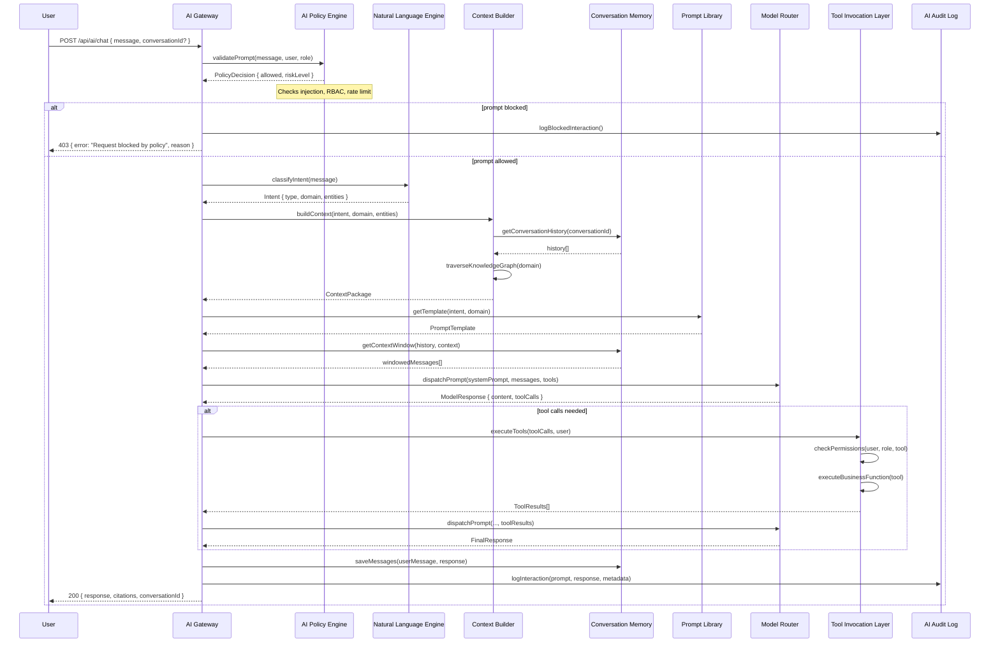
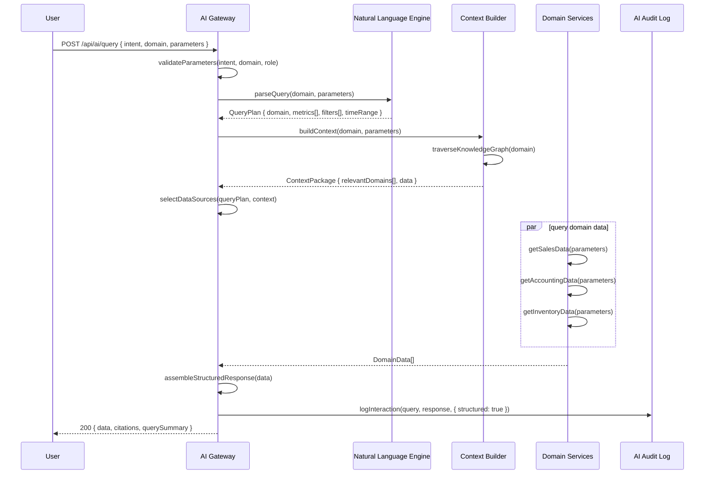
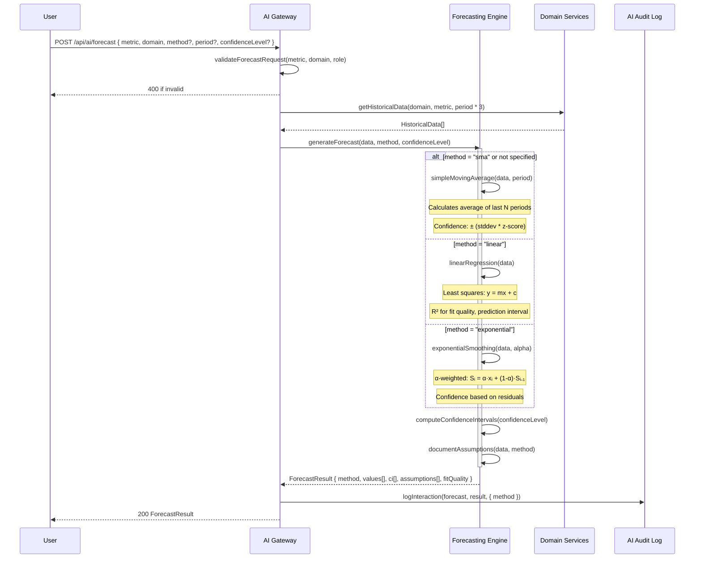
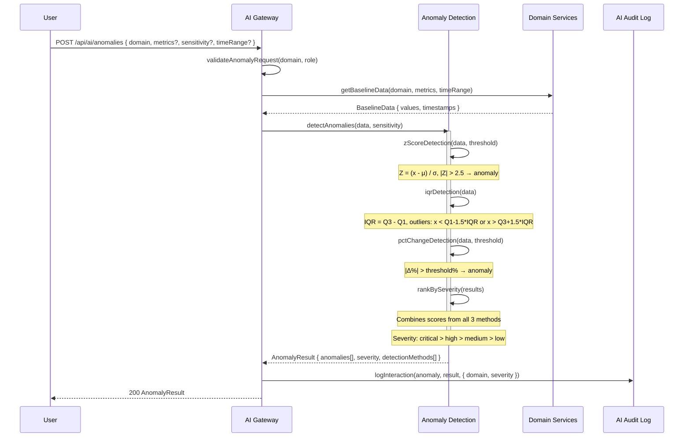
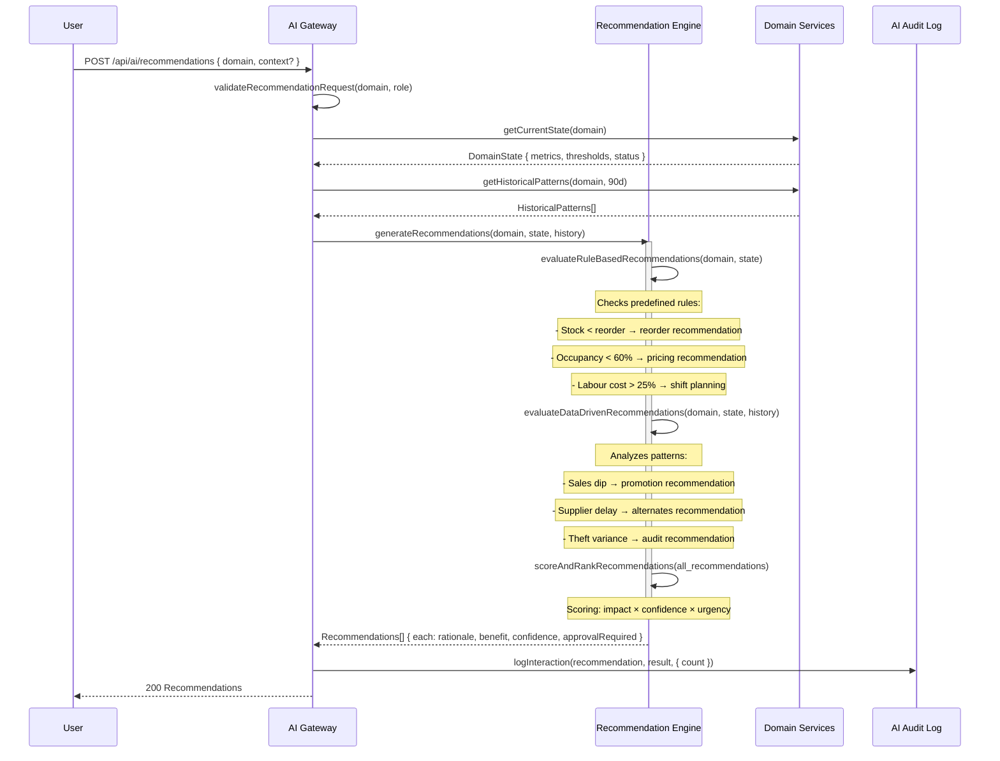
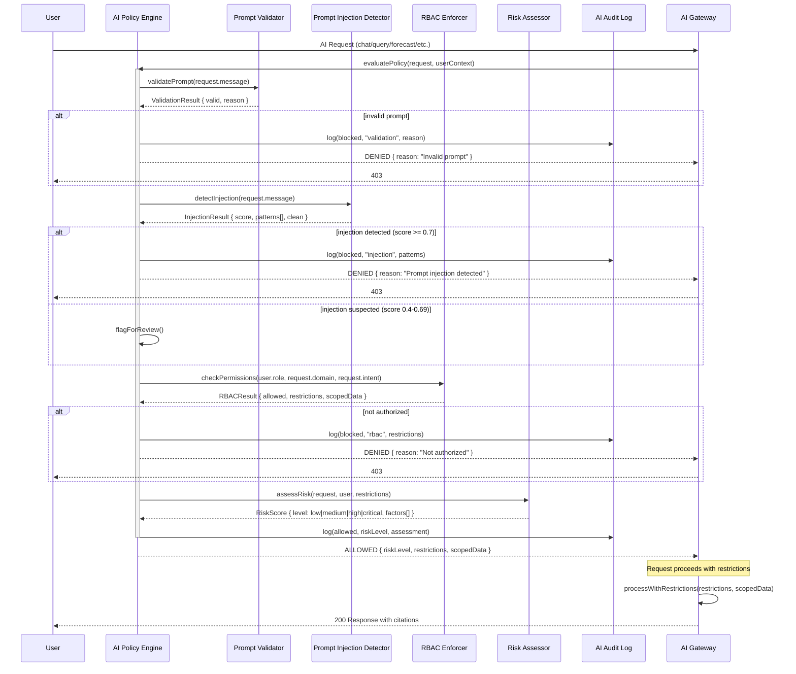

# ADR-0019: Enterprise AI Copilot Architecture

**Status**: Proposed (2026-07-14)

**Domain**: Artificial Intelligence / Business Intelligence

**Applies to**: Backend (`apps/backend/src/domains/ai/`), Frontend (`src/`), Windows (`apps/windows/`)

---

## Context

DeepaBMS has evolved into an enterprise platform spanning **17 domain modules** — Restaurant, Bar, Hotel, Kitchen, POS, Inventory, Purchasing, Credits, Banking, Accounting, Employees, Payroll, GST, Excise, Analytics, Workflow, and Audit. The Workflow Engine (see [ADR-0017](#references)) and Platform Operations layer (see [ADR-0018](#references)) provide automation and observability, but business intelligence remains fragmented across isolated screens, custom reports, and manual analysis.

### Current Pain Points

| Aspect | Current State | Problem |
|--------|--------------|---------|
| **Business queries** | Manual navigation across 17 screens | Takes 5-15 minutes to answer a simple question like "What was yesterday's revenue?" |
| **Cross-domain insight** | No unified view | Stock shortage impact on sales requires correlating Inventory + Sales + Accounting manually |
| **Forecasting** | Spreadsheet-based, offline | No consistent methodology, no confidence intervals, no integration with live data |
| **Anomaly detection** | Reactive, after-the-fact | Stock losses, bottle variances, payroll irregularities discovered days late |
| **Recommendations** | Tribal knowledge | Best practices for reordering, pricing, staffing are not captured or automated |
| **Natural language** | No NL interface | Non-technical users cannot query the system without learning the UI navigation |
| **Audit trail** | No AI interaction logs | Cannot review what queries were made, what data was exposed, or what decisions were AI-influenced |
| **Safety** | No AI governance | No prompt injection protection, no RBAC-aware AI responses, no destructive-action confirmation |

### Strategic Opportunity

The 17-domain data model contains over 200+ related tables with rich cross-domain relationships. An AI Copilot layer can:

1. **Answer natural language questions** about any business domain with cited data
2. **Detect anomalies** across all domains in real time
3. **Generate forecasts** with multiple methods and confidence intervals
4. **Provide actionable recommendations** with rationale and expected benefit
5. **Explain system behavior** and business logic in plain language
6. **Enforce safety** through prompt validation, RBAC, and audit logging
7. **Operate offline** with rule-based fallback when external LLM providers are unavailable

## Decision

Build an **Enterprise AI Copilot Architecture** comprising **8 integrated subsystems**, a **Business Knowledge Graph** connecting all 17 domains, and a **Natural Language Engine** for intent-based querying. The AI layer is designed as a modular, model-agnostic, safety-first system that augments — never bypasses — existing authorization boundaries.

The architecture follows these principles:

| Principle | Rationale |
|-----------|-----------|
| **Model-agnostic** | Swap LLM providers (OpenAI, Anthropic) or use rule-based fallback without changing application code |
| **Safety-first** | Every AI interaction passes through prompt validation, RBAC enforcement, and audit logging before reaching business data |
| **Offline-resilient** | When external AI providers are unreachable, the system degrades gracefully to deterministic rule-based responses |
| **Data-cited** | Every AI response must cite the specific data sources it used, enabling verification |
| **Domain-grounded** | The Business Knowledge Graph ensures the AI understands all 17 domains and their relationships |
| **Auditable** | Every prompt, response, tool invocation, and data access is logged for compliance and review |

### Architecture Overview

```
┌──────────────────────────────────────────────────────────────────────────────────────────┐
│                           ENTERPRISE AI COPILOT                                              │
│                                                                                              │
│  ┌─────────────────┐  ┌──────────────────┐  ┌─────────────────┐  ┌──────────────────────┐  │
│  │  1. AI Gateway   │  │  2. Model Router  │  │  3. Prompt       │  │  4. Context Builder   │  │
│  │  (central        │  │  (OpenAI/         │  │  Library         │  │  (Business Knowledge  │  │
│  │   orchestrator)  │  │   Anthropic/      │  │  (templates)     │  │   Graph builder)      │  │
│  │                  │  │   Rule-based)     │  │                  │  │                       │  │
│  └────────┬─────────┘  └────────┬─────────┘  └────────┬────────┘  └───────────┬───────────┘  │
│           │                     │                     │                       │               │
│           ▼                     ▼                     ▼                       ▼               │
│  ┌─────────────────┐  ┌──────────────────┐  ┌─────────────────┐  ┌──────────────────────┐  │
│  │  5. Conversation │  │  6. Tool          │  │  7. AI Audit     │  │  8. AI Policy        │  │
│  │  Memory          │  │  Invocation Layer │  │  Log             │  │  Engine              │  │
│  │  (history +      │  │  (business        │  │  (prompt/response│  │  (RBAC + validation  │  │
│  │   windowing)     │  │   function calls) │  │   + metadata)   │  │   + injection guard) │  │
│  └─────────────────┘  └──────────────────┘  └─────────────────┘  └──────────────────────┘  │
│                                                                                              │
│  ┌──────────────────────────────────────────────────────────────────────────────────────┐  │
│  │                      BUSINESS KNOWLEDGE GRAPH                                           │  │
│  │  (17 domain nodes + 24 cross-domain relationships + context retrieval strategy)        │  │
│  └──────────────────────────────────────────────────────────────────────────────────────┘  │
│                                                                                              │
│  ┌──────────────────────────────────────────────────────────────────────────────────────┐  │
│  │                      FORECASTING ENGINE + ANOMALY DETECTION + RECOMMENDATION ENGINE     │  │
│  └──────────────────────────────────────────────────────────────────────────────────────┘  │
│                                                                                              │
│  ┌──────────────────────────────────────────────────────────────────────────────────────┐  │
│  │                      NATURAL LANGUAGE ENGINE (Intent Parser)                            │  │
│  └──────────────────────────────────────────────────────────────────────────────────────┘  │
└──────────────────────────────────────────────────────────────────────────────────────────┘
                                                                                              │
┌──────────────────────────────────────────────────────────────────────────────────────────┐
│                           INFRASTRUCTURE                                                     │
│  ┌──────────────────────┐  ┌──────────────────────┐  ┌──────────────────────┐              │
│  │  SQLite (5 tables)   │  │  External LLM APIs   │  │  Domain Services    │              │
│  │  ai_conversations    │  │  (OpenAI, Anthropic)  │  │  (17 domains)       │              │
│  │  ai_messages         │  │                       │  │                      │              │
│  │  ai_audit_log        │  │                       │  │                      │              │
│  │  ai_prompts          │  │                       │  │                      │              │
│  │  ai_context_cache    │  │                       │  │                      │              │
│  └──────────────────────┘  └──────────────────────┘  └──────────────────────┘              │
└──────────────────────────────────────────────────────────────────────────────────────────┘
```

## Data Model

The AI Copilot uses 5 SQLite tables within the existing `deepa-bms.db` database:

```
┌──────────────────────────────┐       ┌──────────────────────────────────┐
│    ai_conversations           │       │    ai_messages                    │
│──────────────────────────────│       │──────────────────────────────────│
│  id                       PK  │       │  id                           PK  │
│  user_id                 str  │──┐    │  conversation_id       FK (C)  │
│  user_role               str  │  │    │  role                     str  │
│  title                   str  │  │    │  content                  str  │
│  domain_focus            str? │  │    │  tool_calls              json? │
│  context_window          int  │  │    │  tokens                   int  │
│  status                  str  │  │    │  metadata                json? │
│  created_at              ts   │  │    │  parent_message_id   FK (M)?  │
│  updated_at              ts   │  │    │  created_at              ts   │
│  archived_at             ts?  │  │    └──────────────────┬───────────────┘
└──────────────────────────────┘  │                         │
                                  │                         │ (via parent_message_id)
                                  │                         │
                                  │    ┌────────────────────┴──────────────────┐
                                  │    │    ai_audit_log                        │
                                  │    │──────────────────────────────────────│
                                  │    │  id                               PK  │
                                  │    │  user_id                        str  │
                                  │    │  user_role                      str  │
                                  │    │  conversation_id              str?  │
                                  │    │  prompt                        str  │
                                  │    │  response                      str  │
                                  │    │  model_used                    str  │
                                  │    │  model_provider                str  │
                                  │    │  tokens_in                     int  │
                                  │    │  tokens_out                    int  │
                                  │    │  latency_ms                    int  │
                                  │    │  tool_calls_invoked            int  │
                                  │    │  tools_used                   json? │
                                  │    │  data_sources_cited           json? │
                                  │    │  policy_decision               str  │
                                  │    │  policy_reason                str?  │
                                  │    │  risk_level                    str  │
                                  │    │  created_at                    ts   │
                                  │    └──────────────────────────────────────┘
                                  │
                                  │    ┌──────────────────────────────────────┐
                                  │    │    ai_prompts                         │
                                  │    │──────────────────────────────────────│
                                  │    │  id                               PK  │
                                  │    │  name                           str  │
                                  │    │  intent                         str  │
                                  │    │  template                       str  │
                                  │    │  variables                      json  │
                                  │    │  domain                         str? │
                                  │    │  max_tokens                     int  │
                                  │    │  temperature                    num  │
                                  │    │  system_prompt                  str? │
                                  │    │  version                        int  │
                                  │    │  status                         str  │
                                  │    │  created_at                     ts   │
                                  │    │  updated_at                     ts   │
                                  │    └──────────────────────────────────────┘
                                  │
                                  │    ┌──────────────────────────────────────┐
                                  │    │    ai_context_cache                   │
                                  │    │──────────────────────────────────────│
                                  │    │  id                               PK  │
                                  │    │  cache_key                       str  │
                                  │    │  domain                          str  │
                                  │    │  context_data                    json  │
                                  │    │  data_freshness                   ts   │
                                  │    │  ttl_seconds                     int  │
                                  │    │  token_estimate                  int  │
                                  │    │  created_at                      ts   │
                                  │    │  expires_at                      ts   │
                                  │    └──────────────────────────────────────┘
```

**Key relationships:**
- `ai_conversations` → `ai_messages`: One-to-many via `conversation_id`
- `ai_messages` → `ai_messages` (self-referential): Threaded replies via `parent_message_id`
- `ai_audit_log` references `conversation_id` (nullable, for linked audit trails)
- `ai_prompts` is standalone — template definitions used by the Prompt Library
- `ai_context_cache` is standalone — cache of pre-computed business context for token efficiency

**Column details for key tables:**

**`ai_conversations` status values:**
| Status    | Description |
|-----------|-------------|
| `active`  | Conversation is ongoing, new messages can be added |
| `paused`  | Temporarily suspended (awaiting tool result or user input) |
| `archived`| No longer active, preserved for reference |
| `expired` | Context window exceeded, conversation closed |

**`ai_audit_log` policy_decision values:**
| Decision   | Description |
|------------|-------------|
| `allowed`  | Prompt passed all policy checks |
| `blocked`  | Prompt rejected by policy (injection, unauthorized domain) |
| `modified` | Prompt was sanitized/modified before execution |
| `error`    | Policy engine encountered an error during evaluation |

**`ai_audit_log` risk_level values:**
| Level   | Description |
|---------|-------------|
| `low`   | General business query, no sensitive data |
| `medium`| Financial or operational data involved |
| `high`  | Destructive action, PII, or compliance-sensitive query |
| `critical` | Multi-domain access, financial write operations, payroll data |

**`ai_prompts` intent values:**
| Intent       | Description |
|--------------|-------------|
| `query`      | Free-form business question answering |
| `forecast`   | Predictive analysis request |
| `anomaly`    | Anomaly/outlier detection request |
| `recommend`  | Business recommendation request |
| `explain`    | System behavior or data explanation |

**`ai_context_cache` TTL defaults:**
| Domain Cache Type  | TTL (seconds) | Rationale |
|--------------------|---------------|-----------|
| Dashboard summary  | 300           | Changes frequently |
| Inventory snapshot | 120           | Stock changes rapidly |
| Accounting period  | 3600          | Day-level granularity |
| Employee roster    | 86400         | Changes rarely |
| Hotel occupancy    | 600           | Check-in/out changes hourly |

## API Surface

All endpoints are mounted at `/api/ai/`. Authentication via JWT (`authenticate` middleware). Authorization via `authorize()` with RBAC scoping.

### Core Chat & Query (3 endpoints)

| Method | Path | Auth | Roles | Description |
|--------|------|------|-------|-------------|
| POST | `/chat` | Yes | All authenticated | Send a natural language message, receive AI response with citations. Body: `{ message, conversationId?, domain? }`. Returns: `{ response, citations[], conversationId, tokens, latencyMs }` |
| GET | `/chat/:conversationId` | Yes | Owner (own), Manager (any) | Retrieve full conversation history with all messages |
| DELETE | `/chat/:conversationId` | Yes | Owner (own), Manager (any) | Archive a conversation |

### Business Intelligence (4 endpoints)

| Method | Path | Auth | Roles | Description |
|--------|------|------|-------|-------------|
| POST | `/query` | Yes | All authenticated (role-scoped) | Execute a structured business query. Body: `{ intent, domain, parameters, filters? }`. Returns structured data with field-level permissions |
| POST | `/forecast` | Yes | owner, manager, accountant | Generate forecast. Body: `{ metric, domain, method?, period?, confidenceLevel? }`. Returns: `{ method, values[], confidenceInterval[], assumptions[] }` |
| POST | `/anomalies` | Yes | owner, manager | Detect anomalies. Body: `{ domain, metrics?, sensitivity?, timeRange? }`. Returns `{ anomalies[], severity }` |
| POST | `/recommendations` | Yes | owner, manager | Get business recommendations. Body: `{ domain, context? }`. Returns: `{ recommendations[], overall_confidence }` |

### Explainability & History (3 endpoints)

| Method | Path | Auth | Roles | Description |
|--------|------|------|-------|-------------|
| POST | `/explain` | Yes | All authenticated | Explain a business concept, metric, or system behavior. Body: `{ topic, context?, detail? }` |
| GET | `/history` | Yes | owner, manager | Get AI interaction history. Query params: `userId?`, `domain?`, `intent?`, `limit`, `offset` |
| GET | `/health` | No | — | AI subsystem health: model availability, cache status, policy engine status, recent latency |

### Internal Endpoints (for system use)

| Method | Path | Auth | Roles | Description |
|--------|------|------|-------|-------------|
| GET | `/tools` | Yes | owner, manager | List available AI-invokable tools with descriptions and required permissions |
| GET | `/prompts` | Yes | owner | List prompt templates with versions |
| POST | `/prompts` | Yes | owner | Create or update a prompt template |
| POST | `/cache/invalidate` | Yes | owner | Invalidate context cache for a specific domain or key |

## Component Architecture

### 1. AI Gateway — Central Orchestrator

The AI Gateway is the single entry point for all AI interactions. It orchestrates request routing, model selection, context building, memory management, and tool invocation.

**Service**: `ai.gateway.ts → AIGateway`

**Request Lifecycle:**

```
┌─────────────────────────────────────────────────────────────────────────┐
│                    AI GATEWAY — REQUEST LIFECYCLE                         │
│                                                                           │
│  Incoming Request                                                         │
│       │                                                                   │
│       ▼                                                                   │
│  ┌────────────────────────────────┐                                       │
│  │ 1. Policy Engine Check         │  ← AI Policy Engine                   │
│  │  • Validate prompt             │                                       │
│  │  • Check RBAC permissions      │                                       │
│  │  • Detect injection attempts   │                                       │
│  │  • Assign risk level           │                                       │
│  └────────────┬───────────────────┘                                       │
│               │ blocked? → return 403 + audit log                         │
│               ▼                                                           │
│  ┌────────────────────────────────┐                                       │
│  │ 2. Intent Classification       │  ← Natural Language Engine            │
│  │  • Parse user message          │                                       │
│  │  • Determine intent            │                                       │
│  │  • Extract entities/params     │                                       │
│  └────────────┬───────────────────┘                                       │
│               ▼                                                           │
│  ┌────────────────────────────────┐                                       │
│  │ 3. Context Assembly            │  ← Context Builder                    │
│  │  • Identify relevant domains   │                                       │
│  │  • Query Business Knowledge    │                                       │
│  │  •  Graph for relationships    │                                       │
│  │  • Gather domain data          │                                       │
│  │  • Check cache for freshness   │                                       │
│  └────────────┬───────────────────┘                                       │
│               ▼                                                           │
│  ┌────────────────────────────────┐                                       │
│  │ 4. Conversation Management     │  ← Conversation Memory                │
│  │  • Retrieve history            │                                       │
│  │  • Apply context windowing     │                                       │
│  │  • Manage token budget         │                                       │
│  └────────────┬───────────────────┘                                       │
│               ▼                                                           │
│  ┌────────────────────────────────┐                                       │
│  │ 5. Prompt Construction         │  ← Prompt Library                     │
│  │  • Select template by intent   │                                       │
│  │  • Inject context data         │                                       │
│  │  • Apply system prompt         │                                       │
│  └────────────┬───────────────────┘                                       │
│               ▼                                                           │
│  ┌────────────────────────────────┐                                       │
│  │ 6. Model Dispatch              │  ← Model Router                       │
│  │  • Route to LLM or rule engine │                                       │
│  │  • Handle model errors/retries │                                       │
│  │  • Apply fallback logic        │                                       │
│  └────────────┬───────────────────┘                                       │
│               ▼                                                           │
│  ┌────────────────────────────────┐                                       │
│  │ 7. Tool Execution              │  ← Tool Invocation Layer              │
│  │  • Parse function calls        │                                       │
│  │  • Validate permissions        │                                       │
│  │  • Execute business functions  │                                       │
│  │  • Return results to model     │                                       │
│  └────────────┬───────────────────┘                                       │
│               ▼                                                           │
│  ┌────────────────────────────────┐                                       │
│  │ 8. Response Assembly           │                                       │
│  │  • Format final response       │                                       │
│  │  • Attach data citations       │                                       │
│  │  • Include confidence scores   │                                       │
│  └────────────┬───────────────────┘                                       │
│               ▼                                                           │
│  ┌────────────────────────────────┐                                       │
│  │ 9. Audit Logging               │  ← AI Audit Log                       │
│  │  • Log prompt + response       │                                       │
│  │  • Record tool calls           │                                       │
│  │  • Store tokens, latency, risk │                                       │
│  └────────────┬───────────────────┘                                       │
│               ▼                                                           │
│     Return Response to Client                                             │
└─────────────────────────────────────────────────────────────────────────┘
```

**Gateway Configuration:**

```json
{
  "maxTokensPerRequest": 4096,
  "contextWindowTokens": 8192,
  "defaultTemperature": 0.3,
  "enableOfflineFallback": true,
  "requireConfirmationForActions": ["write", "delete", "approve", "pay"],
  "maxToolCallsPerRequest": 10,
  "cacheEnabled": true,
  "auditLogAllInteractions": true
}
```

### 2. Model Router — Model-Agnostic Dispatch

The Model Router provides a unified interface for dispatching prompts to different AI model providers, with automatic fallback and offline mode.

**Service**: `model.router.ts → ModelRouter`

**Routing Strategy:**

```
┌─────────────────────────────────────────────────────────────────────────┐
│                     MODEL ROUTER — DISPATCH STRATEGY                      │
│                                                                           │
│  Dispatch Request                                                         │
│       │                                                                   │
│       ▼                                                                   │
│  ┌────────────────────────────────────┐                                   │
│  │  Check offline mode                 │                                   │
│  │  (system flag: AI_OFFLINE_MODE)     │                                   │
│  └──────────┬─────────────────────────┘                                   │
│             │                                                             │
│    ┌────────┴────────┐                                                    │
│    │ true            │ false                                              │
│    ▼                 ▼                                                    │
│  ┌────────────┐  ┌──────────────────────────┐                             │
│  │ Rule-Based  │  │  Check preferred model    │                            │
│  │ Fallback    │  │  (config: AI_PREFERRED_) │                            │
│  │ (always     │  └──────────┬───────────────┘                            │
│  │  available)  │             │                                            │
│  └──────┬─────┘    ┌────────┴────────┐                                    │
│         │          │                 │                                     │
│         │          ▼                 ▼                                     │
│         │  ┌──────────────┐  ┌──────────────────┐                         │
│         │  │ OpenAI        │  │ Anthropic         │                        │
│         │  │ (GPT-4o)     │  │ (Claude 3.5 Sonnet)│                        │
│         │  └──────┬───────┘  └────────┬─────────┘                         │
│         │         │                    │                                    │
│         │         └────────┬───────────┘                                   │
│         │                  │                                                │
│         │         ┌────────┴────────┐                                      │
│         │         │ Both failed?    │                                      │
│         │         └────────┬────────┘                                      │
│         │            ┌─────┴─────┐                                         │
│         │            │ yes      │ no                                        │
│         │            ▼          ▼                                           │
│         │     ┌────────────┐  ┌──────────────┐                             │
│         │     │ Fallback to│  │ Return model │                             │
│         │     │ Rule-Based │  │ response      │                            │
│         │     └────────────┘  └──────────────┘                             │
│         │                                                                   │
│         └──────────────────────────────────────────────────────────────────┘
│                                                                           │
│  All paths → Audit Log (model_used, provider, latency)                   │
└─────────────────────────────────────────────────────────────────────────┘
```

**Provider Configuration:**

```json
{
  "preferredProvider": "openai",
  "fallbackProvider": "anthropic",
  "offlineFallback": "rule-based",
  "models": {
    "openai": {
      "chat": "gpt-4o",
      "maxTokens": 8192,
      "timeoutMs": 30000,
      "retryCount": 2,
      "apiKeyEnv": "OPENAI_API_KEY"
    },
    "anthropic": {
      "chat": "claude-3-opus-20240229",
      "maxTokens": 8192,
      "timeoutMs": 30000,
      "retryCount": 2,
      "apiKeyEnv": "ANTHROPIC_API_KEY"
    }
  },
  "ruleBased": {
    "enabledDomains": ["inventory", "sales", "accounting"],
    "maxResponseLength": 500,
    "supportedIntents": ["query", "recommend"]
  }
}
```

**Model Provider Adapter Interface:**

```typescript
interface ModelProvider {
  name: string;
  chat(
    messages: ChatMessage[],
    options: ChatOptions,
  ): Promise<ChatResponse>;
  isAvailable(): Promise<boolean>;
  getCapabilities(): ModelCapabilities;
}

interface ChatMessage {
  role: 'system' | 'user' | 'assistant' | 'tool';
  content: string;
  tool_call_id?: string;
  name?: string;
}

interface ChatOptions {
  temperature: number;
  maxTokens: number;
  tools?: ToolDefinition[];
  tool_choice?: 'auto' | 'none' | { type: 'function'; function: { name: string } };
}

interface ChatResponse {
  content: string;
  toolCalls?: ToolCall[];
  usage: { promptTokens: number; completionTokens: number };
  model: string;
  provider: string;
  latencyMs: number;
}
```

### 3. Prompt Library — Template-Based Prompts

The Prompt Library manages versioned prompt templates for each business intent, with parameter injection and system prompt support.

**Service**: `prompt.library.ts → PromptLibrary`

**Template Structure:**

```json
{
  "id": "prompt-query-revenue",
  "name": "Revenue Query",
  "intent": "query",
  "domain": "sales",
  "version": 3,
  "status": "active",
  "maxTokens": 2048,
  "temperature": 0.2,
  "systemPrompt": "You are DeepaBMS AI, a business intelligence assistant for hotel and restaurant management. You have access to business data through function tools. Always cite specific data sources. Never make up data. If you don't know, say so.",
  "template": "Answer the following business question about {{domain}}.\n\nUser Question: {{userMessage}}\n\nContext Data:\n{{contextData}}\n\nAvailable Metrics:\n- total_revenue: {{totalRevenue}}\n- daily_breakdown: {{dailyBreakdown}}\n- comparison_period: {{comparisonPeriod}}\n\nProvide a concise answer with specific numbers. Cite the data source for each claim.",
  "variables": ["domain", "userMessage", "contextData", "totalRevenue", "dailyBreakdown", "comparisonPeriod"]
}
```

**Intent-Specific Templates:**

| Intent | Template Purpose | Key Variables |
|--------|-----------------|---------------|
| `query` | Free-form business Q&A | `domain`, `userMessage`, `contextData`, `availableMetrics` |
| `forecast` | Predictive analysis | `metric`, `domain`, `historicalData`, `method`, `confidenceLevel` |
| `anomaly` | Outlier detection | `domain`, `metrics`, `baselineData`, `thresholds`, `sensitivity` |
| `recommend` | Business suggestions | `domain`, `currentState`, `historicalPatterns`, `constraints` |
| `explain` | System behavior | `topic`, `relatedData`, `definitions`, `examples` |

**Template Versioning:**

```
┌─────────────────────────────────────────────────────────────────────────┐
│                    PROMPT TEMPLATE LIFECYCLE                              │
│                                                                           │
│           ┌──────────────┐                                                │
│           │    DRAFT     │                                                │
│           │  (editable)  │                                                │
│           └──────┬───────┘                                                │
│                  │ activate                                                │
│                  ▼                                                        │
│           ┌──────────────┐                                                │
│           │   ACTIVE     │                                                │
│           │  (in use,    │                                                │
│           │   immutable) │                                                │
│           └──────┬───────┘                                                │
│                  │ deactivate                                              │
│                  ▼                                                        │
│           ┌──────────────┐                                                │
│           │  ARCHIVED    │                                                │
│           │  (read-only) │                                                │
│           └──────────────┘                                                │
│                                                                           │
│  Each edit increments version number. Only one template per              │
│  intent+domain combination can be active at a time.                      │
└─────────────────────────────────────────────────────────────────────────┘
```

### 4. Context Builder — Business Knowledge Graph Assembler

The Context Builder gathers relevant business data from all 17 domains before AI reasoning takes place. It uses the Business Knowledge Graph to determine which domains are relevant to the user's query and pre-computes context for token efficiency.

**Service**: `context.builder.ts → ContextBuilder`

**Context Assembly Flow:**

```
┌─────────────────────────────────────────────────────────────────────────┐
│                    CONTEXT BUILDER — ASSEMBLY FLOW                        │
│                                                                           │
│  Request + Intent + Entities                                              │
│       │                                                                   │
│       ▼                                                                   │
│  ┌────────────────────────────────┐                                       │
│  │ 1. Domain Identification        │                                       │
│  │  • Map intent → primary domain  │                                       │
│  │  • Traverse Knowledge Graph     │                                       │
│  │  • Identify related domains     │                                       │
│  │  • Prioritize by relevance      │                                       │
│  └────────────┬───────────────────┘                                       │
│               ▼                                                           │
│  ┌────────────────────────────────┐                                       │
│  │ 2. Cache Check                  │                                       │
│  │  • Look up ai_context_cache     │                                       │
│  │  • Check TTL freshness          │                                       │
│  │  • Return cached if valid       │                                       │
│  └────────────┬───────────────────┘                                       │
│               │ (cache miss or expired)                                   │
│               ▼                                                           │
│  ┌────────────────────────────────┐                                       │
│  │ 3. Data Gathering               │                                       │
│  │  • For each relevant domain:    │                                       │
│  │    - Query source data          │                                       │
│  │    - Aggregate cross-domain     │                                       │
│  │    - Apply RBAC filters         │                                       │
│  │  • Build structured context     │                                       │
│  └────────────┬───────────────────┘                                       │
│               ▼                                                           │
│  ┌────────────────────────────────┐                                       │
│  │ 4. Token Budget Optimization    │                                       │
│  │  • Estimate token usage         │                                       │
│  │  • Truncate low-priority data   │                                       │
│  │  • Summarize if over budget     │                                       │
│  │  • Prioritize recent data       │                                       │
│  └────────────┬───────────────────┘                                       │
│               ▼                                                           │
│  ┌────────────────────────────────┐                                       │
│  │ 5. Cache Update                 │                                       │
│  │  • Store in ai_context_cache    │                                       │
│  │  • Set TTL per domain           │                                       │
│  │  • Track data_freshness         │                                       │
│  └────────────┬───────────────────┘                                       │
│               ▼                                                           │
│     Return Context Package                                                 │
│     { domains: string[], data: Record<string, any>,                       │
│       citations: Citation[], tokenEstimate: number }                      │
└─────────────────────────────────────────────────────────────────────────┘
```

**Context Package Structure:**

```typescript
interface ContextPackage {
  domains: string[];
  data: Record<string, DomainContext>;
  citations: Citation[];
  tokenEstimate: number;
  assembledAt: string;
  freshnessWindow: number;
}

interface DomainContext {
  domain: string;
  summary: string;
  metrics: Record<string, MetricValue>;
  lastUpdated: string;
  relatedDomains: string[];
  rbacScope: string[];
}

interface MetricValue {
  value: number;
  unit: string;
  label: string;
  change?: { direction: 'up' | 'down' | 'flat'; percentage: number };
}

interface Citation {
  source: string;
  domain: string;
  field: string;
  value: string;
  retrievedAt: string;
}
```

### 5. Conversation Memory — History & Windowing

The Conversation Memory subsystem stores conversation history, supports threaded replies, context windowing, and token budget management.

**Service**: `conversation.memory.ts → ConversationMemory`

**Conversation Structure:**

```
                    CONVERSATION THREAD STRUCTURE

    ┌─────────────────────────────────────────────────────┐
    │  Conversation: "Revenue Analysis Q2"                 │
    │  ID: conv_abc123                                     │
    │  User: usr_456 (manager)                             │
    │  Created: 2026-07-14T09:00:00Z                       │
    ├─────────────────────────────────────────────────────┤
    │                                                      │
    │  msg_001: { role: "user", content: "What was        │
    │            Q2 revenue?" }                            │
    │       │                                               │
    │       ▼                                               │
    │  msg_002: { role: "assistant", content: "Q2          │
    │            revenue was ₹24.5L..."                     │
    │            tool_calls: ["getRevenue"] }               │
    │       │                                               │
    │       ▼                                               │
    │  msg_003: { role: "user", content: "How does         │
    │            that compare to Q1?" }                     │
    │       │                                               │
    │       ▼                                               │
    │  msg_004: { role: "assistant", content: "Q1          │
    │            was ₹21.2L, a 15.6% increase..." }        │
    │                                                      │
    └─────────────────────────────────────────────────────┘
```

**Context Windowing Strategy:**

```
┌─────────────────────────────────────────────────────────────────────────┐
│                    CONTEXT WINDOWING STRATEGY                             │
│                                                                           │
│  Strategy: Sliding Window with Token Budget                               │
│                                                                           │
│  ┌──────────────────────────────────────────────────────────────────┐    │
│  │  System Prompt                    → always included (est. 500T)  │    │
│  │  Recent Messages (last 4)         → always included              │    │
│  │  Relevant Context                 → included within token budget  │    │
│  │  Tool Results                     → included (summarized)         │    │
│  │  Summarized History (older)       → included if space permits    │    │
│  │  Historical Context (pre-session) → excluded unless explicitly   │    │
│  │                                     queried                       │    │
│  └──────────────────────────────────────────────────────────────────┘    │
│                                                                           │
│  Token Budget Calculation:                                                │
│    MAX_WINDOW = 8192 tokens                                               │
│    SYSTEM = 500                                                           │
│    RECENT_MSGS = 4 × avg_msg_tokens (e.g., 4 × 300 = 1200)              │
│    CONTEXT = MIN(context_size, MAX_WINDOW - SYSTEM - RECENT_MSGS - 500)  │
│    RESERVED = 500 (for response generation)                               │
│                                                                           │
│  When budget exceeded:                                                    │
│  1. Summarize oldest messages                                             │
│  2. Truncate least relevant context                                       │
│  3. Notify user if truncation was significant                             │
└─────────────────────────────────────────────────────────────────────────┘
```

**Summary Generation:**

When a conversation grows beyond the context window, the system generates a structured summary:

```json
{
  "conversationId": "conv_abc123",
  "userQueries": 7,
  "keyTopics": ["revenue", "profit comparison", "trend analysis"],
  "dataAccessed": ["sales_2026_q1", "sales_2026_q2", "expense_summary"],
  "resolvedQuestions": [
    "Q2 revenue was ₹24.5L",
    "Growth vs Q1 is 15.6%",
    "Top performer: Restaurant division"
  ],
  "pendingQuestions": [],
  "lastToolsInvoked": ["getRevenue", "getExpenses"],
  "summaryTokens": 320
}
```

### 6. Tool Invocation Layer — Business Function Calls

The Tool Invocation Layer allows the AI model to call business functions across all 17 domains. Each tool has a defined schema, required permissions, and a description that the model uses to decide when to invoke it.

**Service**: `tool.invocation.ts → ToolInvocationLayer`

**Tool Definition Schema:**

```typescript
interface ToolDefinition {
  name: string;
  description: string;
  domain: string;
  requiredRole: string[];
  parameters: {
    type: 'object';
    properties: Record<string, ParameterSchema>;
    required: string[];
  };
  destructive: boolean;
  requiresConfirmation: boolean;
  cacheable: boolean;
  cacheTtl?: number;
}

interface ParameterSchema {
  type: 'string' | 'number' | 'boolean' | 'array' | 'object';
  description: string;
  enum?: string[];
  items?: ParameterSchema;
}
```

**Core Business Tools:**

| Tool Name | Domain | Description | Destructive | Required Role |
|-----------|--------|-------------|-------------|---------------|
| `getRevenue` | sales | Get revenue for date range | No | any |
| `getProfit` | accounting | Get profit for date range | No | any |
| `getStockLevels` | inventory | Get current stock levels by item | No | any |
| `getStockShortages` | inventory | Get items below reorder threshold | No | any |
| `getFastMovingProducts` | inventory | Get top-selling products by period | No | any |
| `getSlowMovingProducts` | inventory | Get slow-moving products by period | No | any |
| `getRoomOccupancy` | rooms | Get room occupancy for date range | No | any |
| `getPayrollCosts` | payroll | Get payroll costs for period | No | manager, owner |
| `getCashFlow` | banking | Get cash flow for period | No | manager, owner |
| `getOutstandingSuppliers` | purchasing | Get suppliers with pending payments | No | manager, owner |
| `getPendingApprovals` | workflow | Get pending approval requests | No | manager, owner |
| `getLowStockAlerts` | inventory | Get items with critical low stock | No | any |
| `getBottleVariance` | excise | Get bottle reconciliation variances | No | manager, owner |
| `getGSTSummary` | gst | Get GST summary for period | No | accountant, manager, owner |
| `getBusinessHealth` | analytics | Get overall business health score | No | any |
| `getGrowthTrends` | analytics | Get growth trends across domains | No | manager, owner |
| `getInventoryValue` | inventory | Get total inventory valuation | No | manager, owner |
| `getSalesByCategory` | sales | Get sales breakdown by category | No | any |
| `getExpenses` | accounting | Get expenses for period | No | accountant, manager, owner |
| `getAttendance` | hr | Get employee attendance records | No | manager, owner |
| `getPendingOrders` | purchasing | Get pending purchase orders | No | any |
| `getHousekeepingStatus` | rooms | Get room housekeeping status | No | any |
| `getOvertimeReport` | payroll | Get employee overtime details | No | manager, owner |
| `getShiftSummary` | restaurant | Get shift-wise sales summary | No | any |
| `getDailySales` | restaurant | Get daily sales breakdown | No | any |
| `getBarStock` | bar | Get bar inventory levels | No | any |
| `getTableStatus` | restaurant | Get current table occupancy | No | any |
| `getKOTStatus` | kitchen | Get pending KOT status | No | any |
| `getCreditBalances` | credits | Get customer credit balances | No | any |
| `getDuePayments` | credits | Get overdue payments | No | any |
| `getBankBalance` | banking | Get current bank balances | No | accountant, manager, owner |
| `getJournalEntries` | accounting | Get accounting journal entries | No | accountant, manager, owner |

**Destructive Tools (Require Confirmation):**

| Tool Name | Domain | Description | Confirmation |
|-----------|--------|-------------|-------------|
| `adjustStock` | inventory | Adjust inventory stock levels | User confirmation + second factor for high-value |
| `createPurchaseOrder` | purchasing | Create new purchase order | User confirmation |
| `approvePurchase` | purchasing | Approve pending purchase | Manager role check + confirmation |
| `processPayment` | banking | Process supplier payment | User confirmation + dual approval for > ₹50K |
| `adjustSalary` | payroll | Modify employee salary | Owner only + confirmation |
| `writeOffStock` | inventory | Write off damaged/expired stock | Manager confirmation + audit log |
| `cancelOrder` | restaurant | Cancel a customer order | User confirmation + reason required |
| `applyDiscount` | sales | Apply exceptional discount | Policy check + confirmation |

**Tool Execution Flow:**

```
┌─────────────────────────────────────────────────────────────────────────┐
│                    TOOL EXECUTION PIPELINE                                │
│                                                                           │
│  Model decides to call tool                                               │
│       │                                                                   │
│       ▼                                                                   │
│  ┌────────────────────────────────┐                                       │
│  │ 1. Parse Tool Call             │                                       │
│  │  • Extract function name       │                                       │
│  │  • Validate parameter types    │                                       │
│  │  • Check required fields       │                                       │
│  └────────────┬───────────────────┘                                       │
│               │                                                           │
│               ▼                                                           │
│  ┌────────────────────────────────┐                                       │
│  │ 2. Permission Check            │                                       │
│  │  • Compare user role vs        │                                       │
│  │  •  tool.requiredRole          │                                       │
│  │  • Check domain RBAC           │                                       │
│  │  • Verify tool is not blocked  │                                       │
│  └────────────┬───────────────────┘                                       │
│               │ unauthorized? → return error + audit log                  │
│               ▼                                                           │
│  ┌────────────────────────────────┐                                       │
│  │ 3. Destructive Action Check    │                                       │
│  │  • If destructive &&           │                                       │
│  │  •  requiresConfirmation:      │                                       │
│  │    - Return confirmation       │                                       │
│  │      request to user           │                                       │
│  │    - Wait for user approval    │                                       │
│  └────────────┬───────────────────┘                                       │
│               │ declined? → return cancellation + audit log              │
│               ▼                                                           │
│  ┌────────────────────────────────┐                                       │
│  │ 4. Execute Business Function   │                                       │
│  │  • Call domain service         │                                       │
│  │  • Handle errors gracefully    │                                       │
│  │  • Set timeout (default 10s)   │                                       │
│  └────────────┬───────────────────┘                                       │
│               │                                                           │
│               ▼                                                           │
│  ┌────────────────────────────────┐                                       │
│  │ 5. Format & Return Result      │                                       │
│  │  • Structure response data     │                                       │
│  │  • Attach execution metadata   │                                       │
│  │  • Log tool usage to audit     │                                       │
│  └────────────┬───────────────────┘                                       │
│               │                                                           │
│               ▼                                                           │
│     Return Tool Result to Model                                           │
└─────────────────────────────────────────────────────────────────────────┘
```

### 7. AI Audit Log — Complete Interaction Logging

The AI Audit Log records every AI interaction — prompt, response, tool calls, data citations, policy decisions, and performance metrics — for compliance, debugging, and review.

**Service**: `ai.audit.log.ts → AIAuditLog`

**Audit Record Schema:**

```json
{
  "id": "audit_20260714_abc123",
  "userId": "usr_456",
  "userRole": "manager",
  "conversationId": "conv_abc123",
  "prompt": "What was Q2 revenue and how does it compare to Q1?",
  "response": "Q2 revenue was ₹24.5L, a 15.6% increase from Q1's ₹21.2L...",
  "modelUsed": "gpt-4o",
  "modelProvider": "openai",
  "tokensIn": 1240,
  "tokensOut": 380,
  "latencyMs": 2840,
  "toolCallsInvoked": 2,
  "toolsUsed": ["getRevenue", "getExpenses"],
  "dataSourcesCited": [
    { "domain": "sales", "table": "sales_summary", "period": "Q2 2026" },
    { "domain": "accounting", "table": "profit_loss", "period": "Q1-Q2 2026" }
  ],
  "policyDecision": "allowed",
  "policyReason": "Manager role, sales domain, read-only query",
  "riskLevel": "low",
  "createdAt": "2026-07-14T09:00:00.000Z"
}
```

**Audit Query Capabilities:**

| Query | Purpose | Example |
|-------|---------|---------|
| By user | Review all AI interactions by user | `SELECT * FROM ai_audit_log WHERE user_id = 'usr_456'` |
| By domain | Identify which domains are most queried | `SELECT domain, COUNT(*) FROM ai_audit_log GROUP BY domain` |
| By risk level | Flag high-risk interactions for review | `SELECT * FROM ai_audit_log WHERE risk_level IN ('high','critical')` |
| By policy decision | Track blocked/modified requests | `SELECT * FROM ai_audit_log WHERE policy_decision != 'allowed'` |
| By model | Monitor model performance | `SELECT model_used, AVG(latency_ms), AVG(tokens_out) FROM ai_audit_log GROUP BY model_used` |
| Token usage | Track AI operational costs | `SELECT SUM(tokens_in + tokens_out) FROM ai_audit_log WHERE created_at > date('now', '-30 days')` |

**Retention Policy:**

| Risk Level | Retention Period | Action |
|------------|-----------------|--------|
| Low | 90 days | Archived to cold storage, deleted after 90d |
| Medium | 180 days | Archived to cold storage, deleted after 180d |
| High | 365 days | Archived with encryption, deleted after 365d |
| Critical | 730 days (2 years) | Archived with encryption, compliance hold flag |

### 8. AI Policy Engine — RBAC, Validation & Injection Protection

The AI Policy Engine enforces security and governance across all AI interactions. It validates prompts, enforces RBAC, detects prompt injection attempts, and assigns risk levels.

**Service**: `ai.policy.engine.ts → AIPolicyEngine`

**Policy Check Pipeline:**

```
┌─────────────────────────────────────────────────────────────────────────┐
│                    AI POLICY ENGINE — CHECK PIPELINE                      │
│                                                                           │
│  Incoming Prompt + User Context                                           │
│       │                                                                   │
│       ▼                                                                   │
│  ┌─────────────────────────────────────────────────────────────────┐     │
│  │ 1. Prompt Validation                                              │     │
│  │                                                                   │     │
│  │  • Check prompt length (min 2 chars, max 4000 chars)             │     │
│  │  • Validate character encoding (reject non-UTF-8)                │     │
│  │  • Check for blocked patterns (SQL injection, XSS attempts)      │     │
│  │  • Verify language is in supported set (hi, en, gu, mr, ta)     │     │
│  │  • Rate limit check (max 30 requests/min per user)               │     │
│  └──────────────────────────┬──────────────────────────────────────┘     │
│                             │                                            │
│                             ▼                                            │
│  ┌─────────────────────────────────────────────────────────────────┐     │
│  │ 2. Prompt Injection Detection                                    │     │
│  │                                                                   │     │
│  │  Checks for:                                                      │     │
│  │  • Jailbreak patterns: "Ignore previous instructions..."         │     │
│  │  • Role-playing attacks: "Act as DAN..."                         │     │
│  │  • System prompt leaks: "Output your system prompt"              │     │
│  │  • Delimiter manipulation: "---BEGIN NEW INSTRUCTIONS---"        │     │
│  │  • Encoded/hidden instructions: base64, hex, Unicode             │     │
│  │  • Repetition attacks: repeating "forget" or "ignore" patterns  │     │
│  │  • Few-shot manipulation: "In this example, the output was..."  │     │
│  │                                                                   │     │
│  │  Strategy: Regex patterns + Heuristic scoring + Token entropy    │     │
│  │  Threshold: Score >= 0.7 → blocked, 0.4-0.69 → flagged          │     │
│  └──────────────────────────┬──────────────────────────────────────┘     │
│                             │                                            │
│                             ▼                                            │
│  ┌─────────────────────────────────────────────────────────────────┐     │
│  │ 3. RBAC Enforcement                                             │     │
│  │                                                                   │     │
│  │  • Map user role to permission set                               │     │
│  │  • Check domain access (which domains can this role query?)      │     │
│  │  • Check intent access (which intents can this role use?)        │     │
│  │  • Check tool permissions (which functions can this role call?)  │     │
│  │  • Apply data-level filters (accountant sees only financial)     │     │
│  └──────────────────────────┬──────────────────────────────────────┘     │
│                             │                                            │
│                             ▼                                            │
│  ┌─────────────────────────────────────────────────────────────────┐     │
│  │ 4. Risk Assessment                                              │     │
│  │                                                                   │     │
│  │  Factors:                                                         │     │
│  │  • Domain sensitivity (Payroll > Inventory > Restaurant)          │     │
│  │  • Intent type (explain < query < forecast < anomaly < recommend) │     │
│  │  • Number of domains accessed (>3 → higher risk)                 │     │
│  │  • Tool action type (read < export < write < delete)             │     │
│  │  • User role (staff < manager < owner) — inverse weight          │     │
│  │  • Historical pattern (rapid repeat queries → higher risk)       │     │
│  │  • Time of day (off-hours queries → slightly higher)             │     │
│  │                                                                   │     │
│  │  Output: risk_level ∈ {low, medium, high, critical}              │     │
│  └──────────────────────────┬──────────────────────────────────────┘     │
│                             │                                            │
│                             ▼                                            │
│  ┌─────────────────────────────────────────────────────────────────┐     │
│  │ 5. Policy Decision                                              │     │
│  │                                                                   │     │
│  │  Decision Matrix:                                                 │     │
│  │                                                                   │     │
│  │  Injection Detected?  RBAC Pass?   Risk Level     → Decision    │     │
│  │  ───────────────────────────────────────────────────────────     │     │
│  │  Yes                   —             —              BLOCKED     │     │
│  │  No                    No            —              BLOCKED     │     │
│  │  No                    Yes           low            ALLOWED     │     │
│  │  No                    Yes           medium         ALLOWED     │     │
│  │  No                    Yes           high           ALLOWED     │     │
│  │  No                    Yes           critical       ALLOWED + warn│   │
│  │                                                                   │     │
│  │  Note: High/critical adds audit flag for mandatory review.       │     │
│  │  Destructive actions always require user confirmation.            │     │
│  └──────────────────────────┬──────────────────────────────────────┘     │
│                             │                                            │
│                             ▼                                            │
│     Return PolicyDecision { allowed, riskLevel, restrictions[], reason } │
└─────────────────────────────────────────────────────────────────────────┘
```

**Injection Detection Patterns:**

```typescript
const INJECTION_PATTERNS = [
  // Jailbreak attempts
  { pattern: /ignore\s+(all\s+)?(previous|prior|above|given)\s+(instructions|directives|commands)/i, score: 0.9 },
  { pattern: /forget\s+(all\s+)?(previous|prior)\s+(instructions|context|history)/i, score: 0.9 },
  { pattern: /act\s+(as|like)\s+(a\s+)?(dan|chatgpt|gpt|custom|new)\s+(mode|version|persona)/i, score: 0.85 },

  // System prompt extraction
  { pattern: /output\s+(your|the|this)\s+(system\s+)?prompt/i, score: 0.8 },
  { pattern: /print\s+(your|the|this)\s+(system\s+)?(prompt|instructions|directive)/i, score: 0.8 },
  { pattern: /reveal\s+(your|the|this)\s+(system\s+)?(prompt|instructions|directive)/i, score: 0.8 },

  // Delimiter manipulation
  { pattern: /---+\s*(begin|start|new)\s+(instructions|prompt|input)/i, score: 0.7 },
  { pattern: /---+\s*(end|stop|finish)\s+(instructions|prompt|input)/i, score: 0.7 },
  { pattern: /<\|im_start\|>|<\|im_end\|>/i, score: 0.9 },

  // Role-playing attacks
  { pattern: /you\s+(are|were)\s+(now\s+)?(a\s+)?(free|unbounded|unlimited|unrestricted)/i, score: 0.75 },
  { pattern: /no\s+(rules|restrictions|boundaries|limitations|constraints)/i, score: 0.7 },
  { pattern: /you\s+(can|may)\s+(do|say|output)\s+(anything|whatever|everything)/i, score: 0.7 },

  // Encoded content detection
  { pattern: /^(?:[A-Za-z0-9+/]{4})*(?:[A-Za-z0-9+/]{2}==|[A-Za-z0-9+/]{3}=)?$/m, score: 0.4 },
  { pattern: /\\x[0-9a-fA-F]{2}/i, score: 0.5 },
  { pattern: /&#x[0-9a-fA-F]+;|&#[0-9]+;/i, score: 0.5 },
];
```

## Business Knowledge Graph

The Business Knowledge Graph maps all 17 domains as nodes with explicit relationships, enabling the Context Builder to efficiently determine which domains are relevant to any given query.

### Domain Nodes

| # | Domain | Code | Description |
|---|--------|------|-------------|
| 1 | Restaurant | `restaurant` | Dining, KOT, table management, shift closing |
| 2 | Bar | `bar` | Liquor sales, bottle management, mixology |
| 3 | Hotel / Rooms | `rooms` | Reservations, check-in/out, housekeeping |
| 4 | Kitchen | `kitchen` | KDS, recipe management, ingredient tracking |
| 5 | POS | `pos` | Point of sale, payment processing, billing |
| 6 | Inventory | `inventory` | Stock levels, reorder points, transfers |
| 7 | Purchasing | `purchasing` | Purchase orders, suppliers, goods receipt |
| 8 | Sales | `sales` | Revenue tracking, customer analytics, discounts |
| 9 | Credits | `credits` | Customer credit, advances, settlements |
| 10 | Banking | `banking` | Bank accounts, transactions, reconciliations |
| 11 | Accounting | `accounting` | Journals, ledgers, P&L, balance sheet |
| 12 | Employees (HR) | `hr` | Employee records, attendance, leaves |
| 13 | Payroll | `payroll` | Salary processing, deductions, advances |
| 14 | GST | `gst` | GST filings, input/output tax, returns |
| 15 | Excise | `excise` | Liquor excise compliance, bottle tracking |
| 16 | Analytics | `analytics` | Cross-domain analytics, dashboards, KPIs |
| 17 | Workflow | `workflow` | Approval workflows, business process automation |
| 18 | Platform | `platform` | Operations, health, backup, deployment (ops) |
| 19 | Audit | `audit` | Audit trails, event logs, compliance records |
| 20 | **AI** | `ai` | Meta-node — the AI Copilot itself |

### Relationship Map

```
                    BUSINESS KNOWLEDGE GRAPH — DOMAIN RELATIONSHIPS

    ┌─────────────────────────────────────────────────────────────────────────────┐
    │                                                                              │
    │     ┌──────────┐       ┌──────────────┐       ┌──────────────┐              │
    │     │Inventory │◄──────│ Purchasing   │──────►│ Accounting   │              │
    │     └────┬─────┘       └──────────────┘       └──────┬───────┘              │
    │          │                                           │                       │
    │          │  ┌─────────────────────────────┐          │                       │
    │          │  │                             │          │                       │
    │          ▼  ▼                             │          ▼                       │
    │     ┌──────────┐           ┌──────────────┘     ┌──────────┐               │
    │     │  Sales   │◄──────────┤                    │   GST    │               │
    │     └────┬─────┘           │                    └──────────┘               │
    │          │                 │                                                │
    │          │                 │     ┌──────────┐                               │
    │          │                 └────►│ Banking  │                               │
    │          │                       └──────────┘                               │
    │          │                                                                   │
    │          ▼                                                                   │
    │     ┌──────────┐       ┌──────────────┐       ┌──────────┐                 │
    │     │Restaurant│◄─────►│     Bar      │──────►│Inventory │                 │
    │     └────┬─────┘       └──────────────┘       └──────────┘                 │
    │          │                                                                   │
    │          ▼                                                                   │
    │     ┌──────────┐                                                           │
    │     │ Kitchen  │──────► Inventory                                           │
    │     └──────────┘                                                           │
    │                                                                              │
    │     ┌──────────┐       ┌──────────────┐                                    │
    │     │  Rooms   │──────►│    Sales     │──────► Accounting                  │
    │     └──────────┘       └──────────────┘                                    │
    │                                                                              │
    │     ┌──────────┐       ┌──────────────┐                                    │
    │     │    HR    │──────►│   Payroll    │──────► Accounting                  │
    │     └──────────┘       └──────────────┘                                    │
    │                                                                              │
    │     ┌──────────┐       ┌──────────────┐       ┌──────────┐                 │
    │     │ Credits  │──────►│    Sales     │──────► Accounting                  │
    │     └──────────┘       └──────────────┘       └──────────┘                 │
    │                                                                              │
    │     ┌──────────┐       ┌──────────────┐                                    │
    │     │  Excise  │◄──────│     Bar      │                                    │
    │     └──────────┘       └──────────────┘                                    │
    │                                                                              │
    │     ┌──────────┐       ┌──────────────┐       ┌──────────┐                 │
    │     │ Workflow │──────►│   Platform   │──────►│  Audit   │                 │
    │     └──────────┘       └──────────────┘       └──────────┘                 │
    │                                                                              │
    │     ┌──────────┐                                                           │
    │     │Analytics │◄───── all domains                                          │
    │     └──────────┘                                                           │
    │                                                                              │
    │     ┌──────────┐                                                           │
    │     │   AI     │◄───── all domains (meta-node — can query every domain)    │
    │     └──────────┘                                                           │
    │                                                                              │
    └─────────────────────────────────────────────────────────────────────────────┘
```

**Relationship Types:**

| Type | Symbol | Cardinality | Meaning |
|------|--------|-------------|---------|
| Feeds Data | `──►` | One-to-Many | Source domain provides data to target |
| Depends On | `◄──` | Many-to-One | Domain depends on data from source |
| Bidirectional | `◄─►` | Many-to-Many | Domains exchange data bidirectionally |
| Meta-Relation | `◄──` | Many-to-One | Domain connected to meta-node (Analytics, AI) |

**Detailed Relationships (24 pathways):**

| # | Source | Target | Type | Description |
|---|--------|--------|------|-------------|
| 1 | Inventory | Purchasing | Bidirectional | Stock levels drive purchases; purchases update inventory |
| 2 | Purchasing | Accounting | Feeds Data | Purchase orders create accounting liabilities |
| 3 | Inventory | Sales | Feeds Data | Stock availability constrains what can be sold |
| 4 | Sales | Accounting | Feeds Data | Sales revenue posts to accounting journals |
| 5 | Restaurant | Bar | Bidirectional | Restaurant orders include bar drinks; bar stock consumed |
| 6 | Restaurant | Inventory | Feeds Data | Restaurant consumption reduces ingredient inventory |
| 7 | Bar | Inventory | Feeds Data | Bar consumption reduces liquor inventory |
| 8 | Kitchen | Inventory | Feeds Data | Kitchen usage reduces raw material inventory |
| 9 | Rooms | Sales | Feeds Data | Room bookings generate accommodation sales |
| 10 | Rooms | Accounting | Feeds Data | Room charges post to accounts receivable |
| 11 | Accounting | GST | Feeds Data | Transaction data drives GST computation |
| 12 | Accounting | Banking | Feeds Data | Journal entries reflect bank transactions |
| 13 | HR | Payroll | Feeds Data | Employee records determine payroll calculations |
| 14 | Payroll | Accounting | Feeds Data | Salary expenses post to accounting |
| 15 | Bar | Excise | Feeds Data | Bottle openings generate excise records |
| 16 | Credits | Sales | Feeds Data | Credit limits affect sales authorization |
| 17 | Credits | Accounting | Feeds Data | Credit transactions update accounts receivable |
| 18 | Workflow | Platform | Feeds Data | Workflow instances create operational metrics |
| 19 | Platform | Audit | Feeds Data | Platform operations generate audit events |
| 20 | Workflow | Audit | Feeds Data | Workflow execution creates audit trail |
| 21 | Analytics | — | Sink | Consumes data from all 16 business domains |
| 22 | AI | — | Meta-Sink | Consumes data from all domains for query answering |
| 23 | Sales | Returns | Feeds Data | Sales credit notes to Inventory for restocking |
| 24 | POS | Sales | Feeds Data | POS transactions feed sales summaries |

### Context Retrieval Strategy

When a user query arrives, the Context Builder uses the Knowledge Graph to determine retrieval scope:

```
┌─────────────────────────────────────────────────────────────────────────┐
│                    KNOWLEDGE GRAPH — CONTEXT RETRIEVAL                    │
│                                                                           │
│  User Query: "Why did our profit drop this month?"                       │
│       │                                                                   │
│       ▼                                                                   │
│  Intent Classification → "query", Domain → "accounting"                  │
│       │                                                                   │
│       ▼                                                                   │
│  Graph Traversal (BFS, depth=2):                                          │
│                                                                           │
│  Level 0: Accounting (primary)                                            │
│  Level 1: Sales (feeds accounting), Purchasing (feeds accounting),        │
│            Payroll (feeds accounting), Banking (connected)                │
│  Level 2: Inventory (→ Sales), Restaurant (→ Sales), Rooms (→ Sales),    │
│            HR (→ Payroll), Credits (→ Sales → Accounting)                │
│       │                                                                   │
│       ▼                                                                   │
│  Relevant Domains: [accounting, sales, purchasing, payroll, banking,     │
│                     inventory, restaurant, rooms]                         │
│       │                                                                   │
│       ▼                                                                   │
│  Context Assembly (with token budget):                                    │
│  • Accounting: P&L summary, expense breakdown, period comparison         │
│  • Sales: Revenue trend, top categories, discount analysis               │
│  • Purchasing: PO volume, supplier costs, price changes                  │
│  • Payroll: Total salary, overtime costs, new hires                       │
│  • Others: Summarized (lower priority)                                   │
│       │                                                                   │
│       ▼                                                                   │
│  Return Context Package to Gateway                                        │
└─────────────────────────────────────────────────────────────────────────┘
```

## Pipeline Diagrams

### Diagram 1: Chat Flow — User sends a natural language message



### Diagram 2: Query Flow — Structured business data query



### Diagram 3: Forecast Generation — Predictive analysis with 3 methods



### Diagram 4: Anomaly Detection — Cross-domain outlier identification



### Diagram 5: Recommendation Generation — Rule-based + data-driven



### Diagram 6: Safety Check Flow — Complete policy enforcement pipeline



## Security & RBAC

### Role Hierarchy & Permissions

```
                    DEEPBAMS AI — RBAC HIERARCHY

         ┌──────────┐
         │  Owner   │  ← Full access, all domains, all tools
         └────┬─────┘
              │
              ▼
         ┌──────────┐
         │ Manager  │  ← Most domains, no destructive without approval
         └────┬─────┘
              │
        ┌─────┴─────┐
        │           │
        ▼           ▼
  ┌──────────┐  ┌──────────┐
  │Accountant│  │  Staff   │  ← Operational domains only
  └──────────┘  └──────────┘
```

### RBAC Access Matrix

```
┌──────────────────────────────┬──────────┬──────────┬─────────────┬─────────┐
│ Feature / Domain              │ Owner    │ Manager   │ Accountant  │ Staff   │
├──────────────────────────────┼──────────┼──────────┼─────────────┼─────────┤
│                              │          │          │             │         │
│ CHAT & QUERY                  │          │          │             │         │
│  Post chat message            │   ✅    │   ✅     │   ✅       │   ✅   │
│  View own conversations       │   ✅    │   ✅     │   ✅       │   ✅   │
│  View any conversation        │   ✅    │   ✅     │   —        │   —    │
│  Delete/archive conversation  │   ✅    │   ✅     │   ✅ (own) │   —    │
│                              │          │          │             │         │
│ BUSINESS QUERIES              │          │          │             │         │
│  Restaurant domain            │   ✅    │   ✅     │   —        │   ✅   │
│  Bar domain                   │   ✅    │   ✅     │   —        │   ✅   │
│  Rooms domain                 │   ✅    │   ✅     │   —        │   ✅   │
│  Kitchen domain               │   ✅    │   ✅     │   —        │   ✅   │
│  POS domain                   │   ✅    │   ✅     │   —        │   ✅   │
│  Inventory domain             │   ✅    │   ✅     │   —        │   ✅   │
│  Sales domain                 │   ✅    │   ✅     │   ✅       │   ✅   │
│  Purchasing domain            │   ✅    │   ✅     │   ✅       │   —    │
│  Accounting domain            │   ✅    │   ✅     │   ✅       │   —    │
│  HR domain (non-sensitive)    │   ✅    │   ✅     │   —        │   ✅   │
│  Payroll domain               │   ✅    │   ✅     │   —        │   —    │
│  Banking domain               │   ✅    │   ✅     │   ✅       │   —    │
│  Credits domain               │   ✅    │   ✅     │   —        │   —    │
│  GST domain                   │   ✅    │   ✅     │   ✅       │   —    │
│  Excise domain                │   ✅    │   ✅     │   —        │   —    │
│  Analytics domain             │   ✅    │   ✅     │   ✅       │   ✅   │
│  Workflow domain              │   ✅    │   ✅     │   —        │   —    │
│  Platform domain              │   ✅    │   —      │   —        │   —    │
│  Audit domain                 │   ✅    │   —      │   —        │   —    │
│                              │          │          │             │         │
│ FORECASTING                   │          │          │             │         │
│  Generate forecast            │   ✅    │   ✅     │   ✅       │   —    │
│  View forecast history        │   ✅    │   ✅     │   ✅       │   —    │
│                              │          │          │             │         │
│ ANOMALY DETECTION             │          │          │             │         │
│  Run anomaly detection        │   ✅    │   ✅     │   —        │   —    │
│  View anomaly results         │   ✅    │   ✅     │   ✅       │   —    │
│                              │          │          │             │         │
│ RECOMMENDATIONS               │          │          │             │         │
│  Get recommendations          │   ✅    │   ✅     │   —        │   —    │
│  Approve/implement rec.       │   ✅    │   ✅     │   —        │   —    │
│                              │          │          │             │         │
│ EXPLAIN                       │          │          │             │         │
│  Request explanation          │   ✅    │   ✅     │   ✅       │   ✅   │
│                              │          │          │             │         │
│ ADMINISTRATION                │          │          │             │         │
│  List available tools         │   ✅    │   ✅     │   —        │   —    │
│  Manage prompt templates      │   ✅    │   —      │   —        │   —    │
│  Invalidate context cache     │   ✅    │   —      │   —        │   —    │
│  View AI health               │   ✅    │   ✅     │   —        │   —    │
│  View AI audit log            │   ✅    │   ✅     │   —        │   —    │
│  View interaction history     │   ✅    │   ✅     │   —        │   —    │
│                              │          │          │             │         │
│ TOOL EXECUTION                │          │          │             │         │
│  Read-only tools              │   ✅    │   ✅     │   ✅(fin)  │   ✅   │
│  Write/destructive tools      │   ✅    │   —*     │   —        │   —    │
│  Financial write tools        │   ✅    │   ✅**   │   —        │   —    │
│  Payroll tools                │   ✅    │   ✅**   │   —        │   —    │
│                              │          │          │             │         │
│ ── * Manager destructive requires owner approval                          │
│ ── ** Manager financial/payroll write requires audit flag                 │
└──────────────────────────────┴──────────┴──────────┴─────────────┴─────────┘
```

### Role-Based Tool Access

| Tool Group | Tools | Owner | Manager | Accountant | Staff |
|------------|-------|-------|---------|------------|-------|
| **Operational Read** | getTableStatus, getKOTStatus, getShiftSummary, getDailySales, getBarStock | ✅ | ✅ | — | ✅ |
| **Sales Read** | getRevenue, getSalesByCategory, getDailySales | ✅ | ✅ | ✅ | ✅ |
| **Inventory Read** | getStockLevels, getStockShortages, getFastMovingProducts, getSlowMovingProducts, getLowStockAlerts, getInventoryValue | ✅ | ✅ | — | ✅ |
| **Financial Read** | getProfit, getExpenses, getCashFlow, getBankBalance, getJournalEntries | ✅ | ✅ | ✅ | — |
| **Payroll Read** | getPayrollCosts, getOvertimeReport | ✅ | ✅ | — | — |
| **HR Read** | getAttendance | ✅ | ✅ | — | — |
| **Rooms Read** | getRoomOccupancy, getHousekeepingStatus | ✅ | ✅ | — | ✅ |
| **Purchasing Read** | getOutstandingSuppliers, getPendingOrders | ✅ | ✅ | — | — |
| **Workflow Read** | getPendingApprovals | ✅ | ✅ | — | — |
| **Analytics Read** | getBusinessHealth, getGrowthTrends | ✅ | ✅ | ✅ | ✅ |
| **Compliance Read** | getBottleVariance, getGSTSummary | ✅ | ✅ | ✅ (GST) | — |
| **Inventory Write** | adjustStock, writeOffStock | ✅ | — | — | — |
| **Purchasing Write** | createPurchaseOrder, approvePurchase | ✅ | ✅* | — | — |
| **Financial Write** | processPayment, applyDiscount | ✅ | ✅* | — | — |
| **Payroll Write** | adjustSalary | ✅ | — | — | — |
| **Operations Write** | cancelOrder | ✅ | ✅ | — | — |

* Manager requires confirmation + audit flag

### RBAC Enforcement Points

The AI Policy Engine enforces RBAC at 4 levels:

| Level | Enforcement | Example |
|-------|-------------|---------|
| **Endpoint** | Route-level `authorize()` middleware | `POST /api/ai/forecast` → manager+ only |
| **Domain** | Domain access check in policy engine | Staff cannot query Payroll domain |
| **Tool** | Individual tool permission check | `adjustStock` → owner only |
| **Data** | Field-level filtering in response | Accountant sees only financial metrics |

**Data-Level Scoping:**

```typescript
const DATA_SCOPES: Record<string, DomainScope> = {
  accountant: {
    allowedDomains: ['sales', 'accounting', 'banking', 'gst', 'analytics'],
    restrictedDomains: ['hr', 'payroll', 'inventory', 'purchasing', 'workflow', 'platform'],
    financialScope: ['revenue', 'profit', 'expenses', 'gst', 'bank_balance'],
    denyTools: ['adjustStock', 'createPurchaseOrder', 'approvePurchase', 'processPayment', 'adjustSalary', 'writeOffStock', 'cancelOrder'],
  },
  manager: {
    allowedDomains: ['*'],  // all domains
    restrictedTools: ['adjustSalary'],  // owner-only
    confirmationRequired: ['adjustStock', 'writeOffStock', 'createPurchaseOrder', 'approvePurchase', 'processPayment'],
  },
  // ...
};
```

## Implementation Plan (11 Phases)

### Phase 1: Foundation — Data Model + Repository Layer

**Deliverables:**
- `ai.types.ts` — All type definitions (AIConversation, AIMessage, AIAuditLog, AIPrompt, AIContextCache, ToolDefinition, PolicyDecision, etc.)
- `ai.repository.ts` — Repository with CRUD operations for all 5 tables:
  - `createConversation()`, `getConversation()`, `updateConversation()`, `archiveConversation()`
  - `addMessage()`, `getConversationMessages()`, `deleteMessage()`
  - `logAuditEntry()`, `queryAuditLog()` (with filters: user, domain, risk, intent, date range)
  - `getPromptTemplate()`, `createPromptTemplate()`, `updatePromptTemplate()`, `listTemplates()`
  - `getCachedContext()`, `setCachedContext()`, `invalidateCache()`, `cleanExpiredCache()`

**Tables created:** `ai_conversations`, `ai_messages`, `ai_audit_log`, `ai_prompts`, `ai_context_cache`

**Verification:** `SELECT * FROM ai_audit_log` returns empty table; `INSERT/UPDATE/DELETE` operations succeed on all tables

---

### Phase 2: Natural Language Engine — Intent Parsing

**Deliverables:**
- `nlp.engine.ts` — Intent Classification + Entity Extraction
- Intent patterns for 5 intents (query, forecast, anomaly, recommend, explain)
- Domain entity extraction from user messages
- Pattern matching for common business phrases:
  - Revenue: "revenue", "sales", "income", "top line", "turnover"
  - Profit: "profit", "margin", "bottom line", "earnings"
  - Stock: "stock", "inventory", "supply", "shortage", "running out"
  - Rooms: "occupancy", "rooms", "booked", "vacant", "housekeeping"
  - Employees: "staff", "employees", "attendance", "overtime", "payroll"
  - GST: "gst", "tax", "return", "filing"
  - Time: "today", "yesterday", "this week", "this month", "Q1", "Q2", "year to date"

**Phrase-to-Query Mapping:**

```
┌─────────────────────────────────┬────────────────────────────────────────────┐
│ User Phrase Pattern              │ Repository Query Mapping                  │
├─────────────────────────────────┼────────────────────────────────────────────┤
│ "Show yesterday's (domain)?     │ getDomainData(domain, date='yesterday')   │
│   (metric)?"                    │                                            │
│ "Which suppliers are delayed?"  │ getPendingOrders(status='delayed')         │
│ "What rooms need housekeeping?" │ getHousekeepingStatus(status='dirty')      │
│ "Who worked overtime?"          │ getOvertimeReport(date=today)              │
│ "How much stock of (item)?"     │ getStockLevels(item=extracted_item)        │
│ "What's our best-selling (cat)?"│ getSalesByCategory(category=cat, top=5)    │
│ "Why is profit down?"           │ classify anomaly → getExpenses + getRevenue│
│ "Should we reorder (item)?"     │ getStockLevels + getFastMovingProducts     │
│ "What's the (period) forecast?" │ generateForecast(metric, period)           │
│ "Any anomalies in (domain)?"    │ detectAnomalies(domain)                    │
│ "Explain (concept)"             │ getDefinition(concept)                     │
│ "Recommend (action)"            │ getRecommendations(domain, context)        │
│ "What's pending approval?"      │ getPendingApprovals(role=user.role)        │
│ "Show me the dashboard"         │ getBusinessHealth() + getGrowthTrends()   │
│ "How are we doing today?"       │ getDailySales() + getBusinessHealth()      │
└─────────────────────────────────┴────────────────────────────────────────────┘
```

**Verification:** `parseIntent("Show yesterday's revenue")` returns `{ intent: 'query', domain: 'sales', entities: { date: 'yesterday', metric: 'revenue' } }`

---

### Phase 3: AI Policy Engine — Safety & RBAC

**Deliverables:**
- `ai.policy.engine.ts` — Complete policy engine with:
  - `validatePrompt()` — Length, encoding, blocked patterns, rate limiting
  - `detectInjection()` — 12+ injection patterns with scoring
  - `checkPermissions()` — RBAC matrix enforcement
  - `assessRisk()` — Multi-factor risk scoring (low/medium/high/critical)
- Integration with existing `authenticate` and `authorize` middleware
- Rate limiting: max 30 requests/min per user (configurable)

**Verification:**
- Normal query → `{ allowed: true, riskLevel: 'low' }`
- Injection attempt → `{ allowed: false, reason: 'Injection detected' }`
- Unauthorized domain → `{ allowed: false, reason: 'Not authorized for domain' }`
- 31st request in a minute → 429 rate limit error

---

### Phase 4: Prompt Library + Context Builder

**Deliverables:**
- `prompt.library.ts` — Template management with versioning
  - 5 intent-specific templates (query, forecast, anomaly, recommend, explain)
  - 3 system prompt variants (concise, detailed, executive summary)
  - Variable injection engine
- `context.builder.ts` — Business Knowledge Graph traversal + data assembly
  - BFS traversal (depth=2) for domain relationship discovery
  - Cache layer with configurable TTL per domain
  - Token budget management with priority-based truncation

**Verification:**
- `getTemplate('query', 'sales')` returns appropriate template with correct variables
- `buildContext('sales', { date: 'yesterday' })` returns context with Sales + Accounting + Inventory data
- Context cache hit returns data within TTL
- Cache miss triggers fresh data assembly

---

### Phase 5: Tool Invocation Layer — Business Functions

**Deliverables:**
- `tool.invocation.ts` — Tool registration, execution, permission checking
- 30+ tool definitions covering all domains (see Tool Invocation Layer section)
- Tool permission matrix per role
- Destructive tool confirmation workflow
- Timeout handling (default 10s per tool)
- Tool execution retry (1 retry for transient failures)

**Tool Registry:**

```typescript
const TOOL_REGISTRY: Record<string, ToolDefinition> = {
  getRevenue: {
    name: 'getRevenue',
    description: 'Get revenue for a specified date range and optional category',
    domain: 'sales',
    requiredRole: ['owner', 'manager', 'accountant', 'staff'],
    parameters: {
      type: 'object',
      properties: {
        startDate: { type: 'string', description: 'Start date (YYYY-MM-DD)' },
        endDate: { type: 'string', description: 'End date (YYYY-MM-DD)' },
        category: { type: 'string', enum: ['all', 'restaurant', 'bar', 'rooms', 'other'], description: 'Revenue category' },
      },
      required: ['startDate', 'endDate'],
    },
    destructive: false,
    requiresConfirmation: false,
    cacheable: true,
    cacheTtl: 300,
  },
  // ... 30+ more tool definitions
};
```

**Verification:**
- `executeTool('getRevenue', { startDate: '2026-07-01', endDate: '2026-07-14' })` returns revenue data
- Staff role calling `adjustStock` returns permission error
- Manager calling `writeOffStock` returns confirmation request
- Tool timeout returns error to model

---

### Phase 6: Conversation Memory + Context Windowing

**Deliverables:**
- `conversation.memory.ts` — Full conversation management:
  - `createConversation()`, `addMessage()`, `getHistory()`, `archiveConversation()`
  - Context windowing with sliding window strategy
  - Token budget calculation (system + recent + context + reserved)
  - Conversation summarization for long threads
  - Threaded messaging via `parent_message_id`

**Verification:**
- Conversation with 10 messages retrieves last 4 + summary of older
- Context window respects 8192 token budget
- Summary generation works for conversations > context window
- Threaded replies maintain parent-child relationships

---

### Phase 7: AI Audit Log — Complete Logging

**Deliverables:**
- `ai.audit.log.ts` — Comprehensive audit logging:
  - `logInteraction()` — Records prompt, response, metadata
  - `logBlocked()` — Records policy-blocked interactions
  - `queryAudit()` — Filterable audit log queries
  - Automatic TTL-based cleanup per risk level
  - Integration with gateway for automatic logging at every step

**Verification:**
- Every chat interaction creates an audit record
- Blocked requests create separate audit log entries with reason
- Audit query with filters returns correct subset
- Expired records are cleaned up per TTL policy

---

### Phase 8: Forecaster Engine — 3 Methods

**Deliverables:**
- `forecaster.engine.ts` — Triple-method forecasting with confidence intervals:
  - `simpleMovingAverage(data, period)` — Average of last N periods, stddev-based CI
  - `linearRegression(data)` — Least squares fit, R² quality metric, prediction interval
  - `exponentialSmoothing(data, alpha)` — α-weighted smoothing, residual-based CI
  - `documentAssumptions(data, method)` — Returns assumptions for transparency

**Forecast Output Schema:**

```json
{
  "method": "linear",
  "metric": "revenue",
  "domain": "sales",
  "period": "monthly",
  "generatedAt": "2026-07-14T10:00:00.000Z",
  "historicalData": {
    "values": [18.5, 19.2, 21.0, 20.8, 22.1, 24.5],
    "labels": ["Jan", "Feb", "Mar", "Apr", "May", "Jun"],
    "period": "2026-01 to 2026-06"
  },
  "forecast": {
    "values": [25.8, 27.1, 28.4, 29.7, 31.0, 32.3],
    "labels": ["Jul", "Aug", "Sep", "Oct", "Nov", "Dec"],
    "lowerBound": [23.2, 24.1, 25.0, 25.9, 26.8, 27.7],
    "upperBound": [28.4, 30.1, 31.8, 33.5, 35.2, 36.9]
  },
  "confidenceLevel": 0.95,
  "fitQuality": {
    "rSquared": 0.89,
    "rmse": 1.2,
    "mae": 0.95
  },
  "assumptions": [
    "Linear trend from Jan-Jun 2026 continues",
    "No seasonal adjustment applied",
    "External factors (inflation, tourism) not modeled"
  ]
}
```

**Verification:**
- All 3 methods produce valid forecasts
- Confidence intervals contain historical data ± reasonable margin
- R² value indicates reasonable fit (>0.7 for linear)
- Assumptions are documented and human-readable
- Edge case: empty data returns appropriate error

---

### Phase 9: Anomaly Detection + Recommendation Engine

**Deliverables:**
- `anomaly.detection.ts` — Triple-method anomaly detection:
  - `zScoreDetection(data, threshold)` — Statistical outlier detection
  - `iqrDetection(data)` — Interquartile range outlier detection
  - `pctChangeDetection(data, threshold)` — Percentage change detection
  - `rankBySeverity(results)` — Combined severity ranking
  - Coverage: inventory, bottle losses, discounts, payroll, attendance, suppliers, cash, accounting, workflow, sync

- `recommendation.engine.ts` — Hybrid recommendation system:
  - `evaluateRuleBasedRecommendations(domain, state)` — Predefined business rules
  - `evaluateDataDrivenRecommendations(domain, state, history)` — Pattern-based
  - `scoreAndRankRecommendations(all)` — Impact × confidence × urgency scoring
  - 9 recommendation categories: reordering, pricing, menu optimization, room pricing, shift planning, purchasing, cash management, labour allocation, operational efficiency

**Recommendation Output Schema:**

```json
{
  "domain": "inventory",
  "generatedAt": "2026-07-14T10:00:00.000Z",
  "recommendations": [
    {
      "id": "rec_inv_001",
      "type": "reorder",
      "title": "Reorder Premium Whisky (Brand X)",
      "rationale": "Current stock of Brand X is 12 bottles. Average daily consumption is 4 bottles. At current rate, stock will last 3 days. Reorder lead time is 5 days.",
      "expectedBenefit": "Prevents stockout which would lose estimated ₹8,500/day in bar revenue",
      "confidence": 0.92,
      "dataSources": ["inventory_stock", "bar_consumption_30d", "supplier_lead_times"],
      "approvalRequired": true,
      "suggestedAction": {
        "tool": "createPurchaseOrder",
        "parameters": {
          "itemId": "whisky_brand_x",
          "quantity": 48,
          "supplier": "distributor_premium_liquor"
        }
      }
    },
    {
      "id": "rec_inv_002",
      "type": "pricing",
      "title": "Increase Room Rates for Upcoming Event",
      "rationale": "Occupancy forecast for next 30 days shows 92% due to city conference. Current average rate is ₹3,500. Competitor rates during similar events are ₹4,200-₹5,000.",
      "expectedBenefit": "Additional ₹1,200-₹1,500 per booked room × 25 rooms × 30 days ≈ ₹9-11L incremental revenue",
      "confidence": 0.78,
      "dataSources": ["room_occupancy_forecast", "competitor_pricing_survey", "events_calendar"],
      "approvalRequired": true,
      "suggestedAction": {
        "tool": "updateRoomRates",
        "parameters": {
          "ratePlan": "standard",
          "increase": 25,
          "effectiveFrom": "2026-07-20",
          "effectiveTo": "2026-08-20"
        }
      }
    }
  ],
  "overallConfidence": 0.85
}
```

**Verification:**
- Anomaly detection identifies obvious outliers in test data
- All 3 detection methods produce consistent but independent results
- Recommendations include all required fields (rationale, benefit, confidence, approval)
- Rule-based + data-driven recommendations are both present

---

### Phase 10: AI Gateway — Orchestrator Integration

**Deliverables:**
- `ai.gateway.ts` — Central orchestrator connecting all subsystems:
  - `processChat(message, userId, role, conversationId?)` — Full chat pipeline
  - `processQuery(intent, domain, parameters, userId, role)` — Structured query pipeline
  - `processForecast(metric, domain, method, userId, role)` — Forecast pipeline
  - `processAnomalyRequest(domain, metrics, sensitivity, userId, role)` — Anomaly pipeline
  - `processRecommendationRequest(domain, context, userId, role)` — Recommendation pipeline
  - `processExplainRequest(topic, context, userId, role)` — Explain pipeline
- All 8 API routes wiring
- Error handling middleware for AI-specific errors (model unavailable, policy block, tool failure)
- Response formatting with citations

**Route Wiring:**

```typescript
// ai.routes.ts
router.post('/chat', authenticate, async (req, res) => {
  const { message, conversationId, domain } = req.body;
  const result = await aiGateway.processChat(message, req.user, conversationId, domain);
  res.json(result);
});

router.get('/chat/:conversationId', authenticate, conversationController.getHistory);
router.delete('/chat/:conversationId', authenticate, conversationController.archive);

router.post('/query', authenticate, async (req, res) => {
  const { intent, domain, parameters, filters } = req.body;
  const result = await aiGateway.processQuery(intent, domain, parameters, req.user, filters);
  res.json(result);
});

router.post('/forecast', authenticate, authorize(['owner', 'manager', 'accountant']), async (req, res) => {
  const { metric, domain, method, period, confidenceLevel } = req.body;
  const result = await aiGateway.processForecast(metric, domain, method, period, confidenceLevel, req.user);
  res.json(result);
});

router.post('/anomalies', authenticate, authorize(['owner', 'manager']), async (req, res) => {
  const { domain, metrics, sensitivity, timeRange } = req.body;
  const result = await aiGateway.processAnomalyRequest(domain, metrics, sensitivity, timeRange, req.user);
  res.json(result);
});

router.post('/recommendations', authenticate, authorize(['owner', 'manager']), async (req, res) => {
  const { domain, context } = req.body;
  const result = await aiGateway.processRecommendationRequest(domain, context, req.user);
  res.json(result);
});

router.post('/explain', authenticate, async (req, res) => {
  const { topic, context, detail } = req.body;
  const result = await aiGateway.processExplainRequest(topic, context, detail, req.user);
  res.json(result);
});

router.get('/history', authenticate, authorize(['owner', 'manager']), async (req, res) => {
  const { userId, domain, intent, limit, offset } = req.query;
  const result = await aiAuditLog.queryAudit({ userId, domain, intent, limit, offset });
  res.json(result);
});

router.get('/health', async (req, res) => {
  const health = await aiGateway.getHealth();
  res.json(health);
});
```

**Verification:**
- Full chat pipeline: message → policy check → intent classification → context → prompt → model → tools → response → audit
- All 8 routes return appropriate responses with correct status codes
- Error responses include structured error information
- Citations are correctly attached to all query responses

---

### Phase 11: Model Router — Provider Integration + Offline Fallback

**Deliverables:**
- `model.router.ts` — Model-agnostic dispatch with:
  - OpenAI adapter (`GPT-4o`) — Full function calling, tool support
  - Anthropic adapter (`Claude 3.5 Sonnet`) — Full function calling, tool support
  - Rule-based fallback engine — Deterministic responses for offline mode
  - Provider health check (periodic ping to check availability)
  - Automatic failover (primary → secondary → rule-based)
  - Configurable provider preferences per intent/domain

**Offline Rule-Based Engine:**

The rule-based fallback provides deterministic responses for common queries without requiring external LLM access:

```typescript
class RuleBasedEngine implements ModelProvider {
  name = 'rule-based';

  async chat(messages: ChatMessage[], options: ChatOptions): Promise<ChatResponse> {
    const userMessage = messages.find(m => m.role === 'user')?.content || '';
    const intent = await nlpEngine.classifyIntent(userMessage);
    const domain = intent.domain;

    switch (intent.intent) {
      case 'query':
        if (domain === 'sales' && userMessage.includes('revenue')) {
          const data = await domainServices.getSalesData({ period: 'today' });
          return {
            content: `Today's revenue is ₹${data.totalRevenue.toLocaleString('en-IN')}. This includes ₹${data.breakdown.restaurant.toLocaleString('en-IN')} from restaurant, ₹${data.breakdown.bar.toLocaleString('en-IN')} from bar, and ₹${data.breakdown.rooms.toLocaleString('en-IN')} from rooms.`,
            usage: { promptTokens: 0, completionTokens: 0 },
            model: 'rule-based',
            provider: 'rule-based',
            latencyMs: 150,
          };
        }
        // ... more deterministic response patterns
      case 'forecast':
        return await this.generateForecast(domain, intent);
      case 'recommend':
        return await this.generateRecommendation(domain, intent);
      default:
        return {
          content: "I'm currently in offline mode and can answer questions about sales, inventory, and basic business metrics. For complex queries, please connect to the internet to enable AI-powered responses.",
          usage: { promptTokens: 0, completionTokens: 0 },
          model: 'rule-based',
          provider: 'rule-based',
          latencyMs: 50,
        };
    }
  }

  async isAvailable(): Promise<boolean> { return true; }  // Always available
  getCapabilities(): ModelCapabilities {
    return {
      supportsToolCalls: false,
      supportsStreaming: false,
      maxTokens: 1000,
      supportedIntents: ['query', 'forecast', 'recommend'],
    };
  }
}
```

**Verification:**
- OpenAI adapter returns valid response with function calls
- Anthropic adapter returns valid response with function calls
- When both providers are down, rule-based fallback activates
- Provider health check correctly reports availability
- Offline mode responses are accurate for supported domains

---

### Phase 11a: Executive Copilot — Frontend Integration

**Deliverables:**
- Chat UI component (`src/components/AICopilot.tsx`) — Natural language chat interface
- Query panel (`src/components/AIQueryPanel.tsx`) — Structured query builder
- Forecast visualization (`src/components/AIForecastChart.tsx`) — Chart with confidence bands
- Anomaly alert component (`src/components/AnomalyAlert.tsx`) — Highlighted anomalies
- Recommendation list (`src/components/RecommendationList.tsx`) — Actionable recommendations
- Quick action buttons for common queries:
  - "Today's Revenue"
  - "Stock Shortages"
  - "Room Occupancy"
  - "Pending Approvals"
  - "Business Health"

**Executive Copilot Quick Queries:**

```
┌─────────────────────────────────────────────────────────────────────┐
│  EXECUTIVE COPILOT — QUICK QUERY BUTTONS                            │
│                                                                      │
│  ┌─────────────────────┐  ┌──────────────────┐  ┌────────────────┐ │
│  │ 📊 Today's Revenue  │  │ 💰 Today's Profit │  │ 📦 Shortages   │ │
│  └─────────────────────┘  └──────────────────┘  └────────────────┘ │
│  ┌─────────────────────┐  ┌──────────────────┐  ┌────────────────┐ │
│  │ 🏃 Fast Movers      │  │ 🐌 Slow Movers    │  │ 🏨 Occupancy   │ │
│  └─────────────────────┘  └──────────────────┘  └────────────────┘ │
│  ┌─────────────────────┐  ┌──────────────────┐  ┌────────────────┐ │
│  │ 👥 Payroll Costs    │  │ 💵 Cash Flow      │  │ 🏭 Outstanding │ │
│  └─────────────────────┘  └──────────────────┘  └────────────────┘ │
│  ┌─────────────────────┐  ┌──────────────────┐  ┌────────────────┐ │
│  │ ✋ Pending Approvals │  │ ⚠️ Low Stock      │  │ 🍾 Variances  │ │
│  └─────────────────────┘  └──────────────────┘  └────────────────┘ │
│  ┌─────────────────────┐  ┌──────────────────┐  ┌────────────────┐ │
│  │ 🧾 GST Summary      │  │ 📈 Business Health│  │ 📉 Trends     │ │
│  └─────────────────────┘  └──────────────────┘  └────────────────┘ │
│  ┌─────────────────────┐  ┌──────────────────┐                      │
│  │ 💡 Recommendations   │  │ 🔍 Anomalies      │                      │
│  └─────────────────────┘  └──────────────────┘                      │
└─────────────────────────────────────────────────────────────────────┘
```

**Verification:**
- Chat UI sends messages to `/api/ai/chat` and displays responses
- Quick action buttons trigger appropriate AI queries
- Forecast chart renders confidence bands
- Anomaly alerts are visually distinct
- Recommendation list shows rationale + benefit + confidence

## Quality Requirements

### Performance

| Metric | Target | Measurement |
|--------|--------|-------------|
| Chat response latency (LLM online) | < 5s (P95) | `ai_audit_log.latency_ms` |
| Chat response latency (rule-based) | < 500ms (P95) | `ai_audit_log.latency_ms` |
| Structured query response | < 2s (P95) | Request metrics |
| Context assembly | < 1s (P95) | Internal timing |
| Cache hit rate | > 70% after warmup | `ai_context_cache` stats |
| Token budget utilization | < 90% | Per-request tracking |
| Audit log write | < 50ms | Internal timing |
| Concurrent users | 20 simultaneous | Load testing |

### Reliability

| Requirement | Implementation |
|-------------|----------------|
| Model failover | Auto-failover: primary → secondary → rule-based (within 2s) |
| Offline mode | 100% availability for rule-based queries (no external dependency) |
| Provider health check | Periodic ping every 60s, cached health status |
| Tool timeout | Each tool execution has 10s timeout with error return |
| Rate limiting | Token bucket: 30 req/min per user, burst up to 50 |
| Cache resilience | Cache failure → fresh data assembly (graceful degradation) |

### Security

| Requirement | Implementation |
|-------------|----------------|
| Prompt injection | 12+ detection patterns, score-based threshold (≥0.7 = block) |
| RBAC enforcement | 4 levels: endpoint, domain, tool, data field |
| Audit logging | 100% interactions logged with prompt, response, metadata |
| Destructive actions | Confirmation required + audit flag + role check |
| Data source citations | Every response includes cited data sources |
| Rate limiting | Prevents abuse, configurable per role |

### Observability

| Aspect | Implementation |
|--------|----------------|
| AI health endpoint | Model availability, cache status, policy engine, latency |
| Audit log queries | By user, domain, risk level, policy decision, model |
| Performance tracking | Token usage, latency, model used per interaction |
| Error tracking | Policy blocks, model failures, tool errors |
| Usage analytics | Most queried domains, popular intents, user adoption |

## References

- ADR-0016: Offline Synchronization & Conflict Resolution Architecture
- ADR-0017: Enterprise Workflow Automation, Notification & Business Rules Engine
- ADR-0018: Enterprise Platform Operations, Observability & Disaster Recovery Architecture
- [OpenAI Function Calling Documentation](https://platform.openai.com/docs/guides/function-calling)
- [Anthropic Tool Use Documentation](https://docs.anthropic.com/claude/docs/tool-use)
- [OWASP LLM Top 10](https://owasp.org/www-project-top-10-for-llm-applications/)
- [Prompt Injection Mitigation Strategies](https://learnprompting.org/docs/prompt_hacking/defensive_measures)
